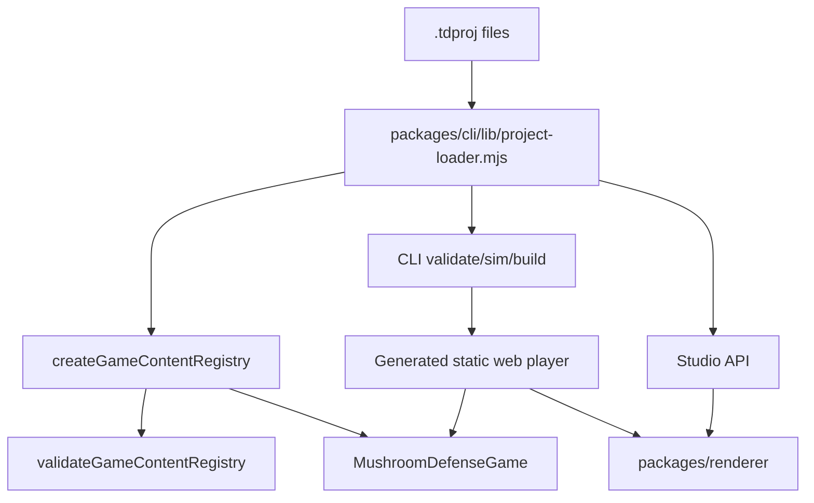

# Architecture

## System Overview

Mycelium Kit has four layers:

```text
.tdproj project data
  -> @mycelium/engine content registry
  -> deterministic headless simulation
  -> CLI, Studio, renderer, and generated web player
```

The engine owns tower-defense rules. The CLI and Studio own project loading, migrations, filesystem operations, validation UX, source map compilation, asset copying, build output, and local serving. The renderer owns browser drawing over snapshots and map definitions. The generated web player imports the compiled engine, renderer, and project data.

## Module Boundaries

| Area | Owns | May Depend On | Must Not Depend On |
| --- | --- | --- | --- |
| `packages/engine/src/simulation` | Deterministic gameplay state, tower/enemy mechanics, actions, snapshots | `packages/engine/src/content` types, simulation helpers | DOM, Node, filesystem, Studio, CLI, browser APIs |
| `packages/engine/src/content` | `GameContentRegistry`, project content validation, runtime content contracts | simulation types and map helpers | Studio UI, CLI filesystem code |
| `packages/cli` | `.tdproj` loading, normalization, engine compilation, validate/sim/build/create commands | compiled engine, Node standard library | Browser DOM, Studio UI state |
| `packages/studio` | Local editor server and browser UI for editing project files | CLI project loader, Node standard library, project files | Direct gameplay rule reimplementation |
| `packages/renderer` | Browser canvas rendering over engine snapshots and map definitions | Browser canvas APIs, serializable content data | Engine internals, Node, filesystem, Studio server |
| `examples/*.tdproj` | Example source projects | documented `.tdproj` schema | Generated build artifacts as source |

## Layering Rules

Allowed dependency direction:

`engine types/helpers -> engine content -> engine simulation -> cli/studio/player adapters`

Renderer is a sibling adapter: it consumes serializable snapshots and project visual data, but it must not own gameplay state or import engine internals.

Studio and CLI MAY share Node project-loader code. Engine MUST remain importable as compiled browser-safe ES modules.

## Data Flow



## Project Format

`.tdproj` is a directory, not a binary file. Source files are stable JSON and should remain git-friendly:

- `project.json`
- `content/balance.json`
- `content/world-map.json`
- `content/visuals.json`
- `maps/src/*.tmj`
- `maps/compiled/maps.json`
- `build-targets.json`

`.mycelium/` is local working state for backups/session files and MUST NOT be committed.

## Cross-Cutting Concerns

- Validation: `validateGameContentRegistry` is canonical for cross-reference and numeric guards.
- Simulation: `MushroomDefenseGame` is canonical for gameplay behavior; CLI and Studio must call engine APIs instead of duplicating rules.
- Build: `packages/cli/build.mjs` validates the project, compiles engine runtime, and emits a static web bundle.
- Maps: `packages/cli/lib/map-compiler.mjs` compiles `maps/src/*.tmj` into runtime maps.
- Migrations: `packages/cli/lib/project-migrations.mjs` applies schema migrations in memory; `npm run migrate -- --write` persists them with backups.
- Writes: Studio uses hash-guarded atomic writes and backs up changed files under `.mycelium/`.
- Assets: `content/visuals.json` is the visual catalog. Asset paths are project-relative only; build copies safe referenced files into `dist`.
- Observability: Studio save/sim/build/map compile/asset import actions write JSONL traces under `.mycelium/runs/`.

## Invariants

- MUST keep `packages/engine` browser-safe and Node-free.
- MUST validate a project before build.
- MUST normalize legacy project fields in the Node loader, not inside the engine.
- MUST keep generated output under a project output directory such as `dist`.
- MUST NOT hardcode Mushroom Rouge/Rizoma local paths into runtime code.
- MUST keep asset imports project-relative and reject absolute paths, external URLs, and `..` traversal.

## Renderers

The build emits one of two web players per build target (`build-targets.json` → `target.renderer`):

- `canvas` (default) — the zero-dependency shared canvas renderer contract.
- `phaser` — a Phaser 3 scene player. Phaser is vendored at `packages/renderer/vendor/phaser.min.js` and copied to `dist/vendor/`, so the offline PWA still works (no CDN). Both players share the engine, project data, and HUD.

## Maps

`maps/src/*.tmj` are Tiled-style sources. The compiler (`packages/cli/lib/map-compiler.mjs`) reads the `terrain` tile layer (`layers[].data`, GID↔terrain) as the authoritative terrain grid and merges explicit `terrainOverrides` on top. The Studio Maps tab is a layer-based painter (drag-paint into the tile layer, layer-visibility toggles for terrain/markers/path).

## Current Limitations

- `content/visuals.json` has catalog editing and safe import, but sprite-sheet frame picking remains future work.
- The Phaser player renders towers/enemies as shapes; sprite-atlas rendering from the visual catalog is future work.
- Desktop/Tauri packaging is not implemented.
