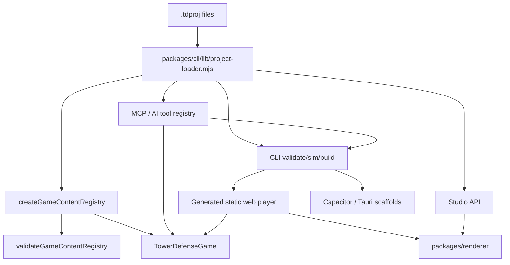

# Architecture

## System Overview

TowerForge has project data, a pure engine core, and adapter layers around it:

```text
.tdproj project data
  -> Node project loader / schema normalization
  -> @towerforge/engine content registry
  -> deterministic headless simulation
  -> CLI, Studio, MCP/AI tools, renderer, generated player, and packaging adapters
```

The engine owns tower-defense rules. The CLI, Studio, and MCP tools own project loading, migrations, filesystem operations, validation UX, source map compilation, asset copying, build output, native scaffolding, and local serving. The renderer owns browser drawing over snapshots and map definitions. The generated web player imports the compiled engine, renderer, and project data.

## Module Boundaries

| Area | Owns | May Depend On | Must Not Depend On |
| --- | --- | --- | --- |
| `packages/engine/src/simulation` | Deterministic gameplay state, tower/enemy mechanics, actions, snapshots | `packages/engine/src/content` types, simulation helpers | DOM, Node, filesystem, Studio, CLI, browser APIs |
| `packages/engine/src/content` | `GameContentRegistry`, project content validation, runtime content contracts | simulation types and map helpers | Studio UI, CLI filesystem code |
| `packages/cli` | `.tdproj` loading, normalization, engine compilation, validate/sim/build/create commands | compiled engine, Node standard library | Browser DOM, Studio UI state |
| `packages/studio` | Local editor server and browser UI for editing project files | CLI project loader, Node standard library, project files | Direct gameplay rule reimplementation |
| `packages/mcp` | Transport-agnostic constructor tool registry plus stdio MCP server | CLI project loader, map compiler, packaging helpers, validation | Gameplay rules outside engine APIs, broad unvalidated filesystem writes |
| `packages/renderer` | Browser canvas rendering over engine snapshots and map definitions | Browser canvas APIs, serializable content data | Engine internals, Node, filesystem, Studio server |
| `examples/*.tdproj` | Example source projects | documented `.tdproj` schema | Generated build artifacts as source |

## Layering Rules

Allowed dependency direction:

`engine types/helpers -> engine content -> engine simulation -> cli/studio/mcp/player adapters`

Renderer is a sibling adapter: it consumes serializable snapshots and project visual data, but it must not own gameplay state or import engine internals.

Studio, CLI, and MCP MAY share Node project-loader code. Engine MUST remain importable as compiled browser-safe ES modules.

## Data Flow



## Project Format

`.tdproj` is a directory, not a binary file. Source files are stable JSON and should remain git-friendly:

- `project.json`
- `content/balance.json`
- `content/world-map.json`
- `content/visuals.json`
- `maps/src/*.tmj`
- `maps/compiled/maps.json`
- `build-targets.json`

`.towerforge/` is local working state for backups/session files and MUST NOT be committed.

## Cross-Cutting Concerns

- Validation: `validateGameContentRegistry` is canonical for cross-reference and numeric guards.
- Simulation: `TowerDefenseGame` is canonical for gameplay behavior; CLI and Studio must call engine APIs instead of duplicating rules.
- Build: `packages/cli/build.mjs` validates the project, compiles engine runtime, and emits a static web bundle.
- Packaging: `packages/cli/package.mjs` wraps a built web bundle into Capacitor mobile or Tauri desktop scaffolds. It does not sign, upload, or publish.
- Maps: `packages/cli/lib/map-compiler.mjs` compiles `maps/src/*.tmj` into runtime maps.
- Migrations: `packages/cli/lib/project-migrations.mjs` applies schema migrations in memory; `npm run migrate -- --write` persists them with backups.
- Writes: Studio uses hash-guarded atomic writes and backs up changed files under `.towerforge/`.
- Assets: `content/visuals.json` is the visual catalog. Asset paths are project-relative only; build copies safe referenced files into `dist`.
- MCP and AI: `packages/mcp/tools.mjs` is the shared tool contract for the MCP server and Studio AI Designer. Tools advertise `riskClass` and `sideEffect`, use strict schemas where implemented, and prefer dry-run/validated write paths with backups and rollback.
- Observability: Studio save/sim/build/map compile/asset import actions write JSONL traces under `.towerforge/runs/`. CLI/MCP simulation reports include aggregate event counts, event timeline, resource timeline, milestone snapshots, strategy inputs, and next valid actions.

## Agent Tool Contract

Agent-facing tools are application contracts, not raw filesystem access.

- Read/compute tools such as `get_project_summary`, `validate_project`, `simulate_mission`, `compile_maps_dry_run`, and `balance_report` MUST be safe to run without mutating project source files.
- Local write tools such as `compile_maps`, `apply_validated_patch`, `set_enemy_stat`, `upsert_tower`, `add_wave_group`, `bind_sprite`, `build_project`, `package_mobile`, and `package_desktop` MUST validate inputs, scope writes under the active project, and return structured results.
- Balance and visual writes MUST create `.towerforge/mcp-backups` backups and roll back when post-write validation fails.
- Studio AI Designer MUST reuse the MCP `callTool` surface with `projectDir` forced to the server's active project instead of letting the model choose arbitrary project roots.

## Invariants

- MUST keep `packages/engine` browser-safe and Node-free.
- MUST validate a project before build.
- MUST normalize legacy project fields in the Node loader, not inside the engine.
- MUST keep generated output under a project output directory such as `dist`.
- MUST NOT hardcode any specific game's content ids or local paths into runtime code (see the content-id-agnostic invariant).
- MUST keep asset imports project-relative and reject absolute paths, external URLs, and `..` traversal.

## Renderers

The build emits one of two web players per build target (`build-targets.json` → `target.renderer`):

- `canvas` (default) — the zero-dependency shared canvas renderer contract.
- `phaser` — a Phaser 3 scene player. Phaser is vendored at `packages/renderer/vendor/phaser.min.js` and copied to `dist/vendor/`, so the offline PWA still works (no CDN). Both players share the engine, project data, and HUD.

## Maps

`maps/src/*.tmj` are Tiled-style sources. The compiler (`packages/cli/lib/map-compiler.mjs`) reads the `terrain` tile layer (`layers[].data`, GID↔terrain) as the authoritative terrain grid and merges explicit `terrainOverrides` on top. The Studio Maps tab is a layer-based painter (drag-paint into the tile layer, layer-visibility toggles for terrain/markers/path).

## Current Limitations

- Canvas renderer and Studio playtest render standalone sprites and atlas-frame sprites from `content/visuals.json`. Remaining asset gaps are stronger binding workflows, themed asset-pack import, and richer previews.
- The Phaser player is shipped as an offline vendored build target, but it is still shape-first; sprite/atlas parity with the canvas renderer remains future work.
- Capacitor mobile and Tauri desktop scaffold export are shipped. Store signing, store submission, cloud publishing, and upload automation are not implemented.
- Mechanics still rely on closed unions for attack kinds, abilities, and statuses. A composable trigger/effect model remains roadmap work.
- MCP has validated granular balance/visual write tools, but still lacks schema introspection, generic entity CRUD/delete, source map authoring, and optimistic revision tokens.
