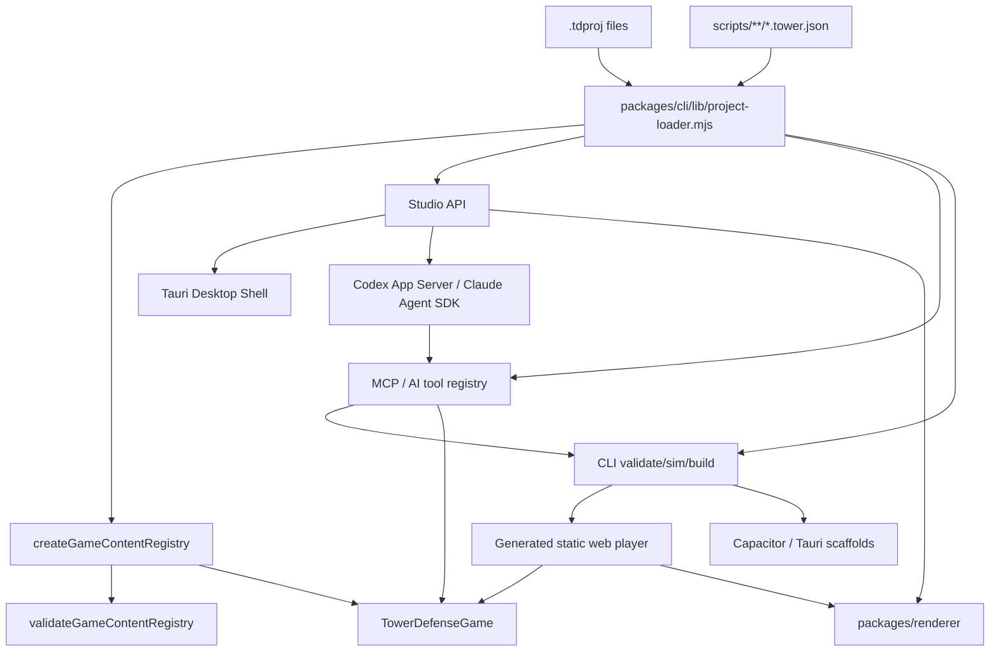

# Architecture

## System Overview

TowerForge has project data, a pure engine core, and adapter layers around it:

```text
.tdproj project data
  -> Node project loader / schema normalization
  -> @towerforge/engine content registry
  -> deterministic headless simulation
  -> CLI, Studio, MCP/AI tools, renderer, generated player, and packaging adapters
```

The engine owns tower-defense rules. The CLI, Studio, and MCP tools own project loading, migrations, filesystem operations, validation UX, source map compilation, asset copying, build output, native scaffolding, and local serving. The renderer owns browser drawing over snapshots and map definitions. The generated web player imports the compiled engine, renderer, and project data.

## Module Boundaries

| Area | Owns | May Depend On | Must Not Depend On |
| --- | --- | --- | --- |
| `packages/engine/src/simulation` | Deterministic gameplay state, tower/enemy mechanics, TowerScript execution, actions, snapshots | `packages/engine/src/content` types, simulation and scripting helpers | DOM, Node, filesystem, Studio, CLI, browser APIs |
| `packages/engine/src/scripting` | Versioned TowerScript types, expression evaluation, validation, and runtime limits | serializable simulation/content types | JavaScript evaluation, DOM, Node, filesystem, network, renderer APIs |
| `packages/engine/src/content` | `GameContentRegistry`, project content validation, runtime content contracts | simulation types and map helpers | Studio UI, CLI filesystem code |
| `packages/cli` | `.tdproj` loading, normalization, engine compilation, validate/sim/build/create commands | compiled engine, Node standard library | Browser DOM, Studio UI state |
| `packages/studio` | Local editor server, browser UI, direct AI adapters, and account-runtime bridge | CLI project loader, shared tool registry, official Codex/Claude runtimes, Node standard library, project files | Direct gameplay rule reimplementation, OAuth credential parsing, arbitrary agent shell/filesystem access |
| `packages/desktop` | Tauri shell, native menus/window lifecycle, packaged Studio runtime, bundled Node/Codex/Claude runtimes, desktop installers | Studio command bridge, Studio server, CLI/MCP/renderer runtime files, Tauri/Rust shell code | Gameplay rules, project schema forks, renderer-specific gameplay behavior |
| `packages/mcp` | Transport-agnostic constructor tool registry plus stdio MCP server | CLI project loader, map compiler, packaging helpers, validation | Gameplay rules outside engine APIs, broad unvalidated filesystem writes |
| `plugins/towerforge` | Canonical Codex plugin source bundle and generated local MCP runtime | Versioned copies of MCP/CLI/engine/renderer runtime files | Cloud backend, credentials, arbitrary workspace discovery, source-only build dependencies |
| `packages/renderer` | Browser canvas rendering over engine snapshots and map definitions | Browser canvas APIs, serializable content data | Engine internals, Node, filesystem, Studio server |
| `examples/*.tdproj` | Example source projects | documented `.tdproj` schema | Generated build artifacts as source |

## Layering Rules

Allowed dependency direction:

`engine types/helpers -> engine content -> engine simulation -> cli/studio/mcp/player adapters`

Renderer is a sibling adapter: it consumes serializable snapshots and project visual data, but it must not own gameplay state or import engine internals.

Studio, CLI, and MCP MAY share Node project-loader code. Engine MUST remain importable as compiled browser-safe ES modules.

## Data Flow



## Project Format

`.tdproj` is a directory, not a binary file. Source files are stable JSON and should remain git-friendly:

- `project.json`
- `content/balance.json`
- `content/world-map.json`
- `content/visuals.json`
- `content/story-comics.json`
- `content/battle-backgrounds.json`
- `maps/src/*.tmj`
- `maps/compiled/maps.json`
- `scripts/**/*.tower.json`
- `build-targets.json`

`.towerforge/` is local working state for backups/session files and MUST NOT be committed.

## Cross-Cutting Concerns

- Validation: `validateGameContentRegistry` is canonical for cross-reference and numeric guards.
- Simulation: `TowerDefenseGame` is canonical for gameplay behavior; CLI and Studio must call engine APIs instead of duplicating rules.
- Build: `packages/cli/build.mjs` validates the project, compiles engine runtime, and emits an offline static web bundle plus an optional `file://`-runnable `index.single.html`.
- Game packaging: `packages/cli/package.mjs` emits a deterministic portable web ZIP with a loopback launcher, or wraps the web bundle into Capacitor mobile / Tauri desktop scaffolds. It does not sign, upload, or publish.
- Studio desktop packaging: `packages/desktop` builds installable TowerForge Studio apps with Tauri v2 and bundled Node, Codex, and Claude Code runtimes. The packaged runtime uses prebuilt `packages/engine/dist` and MUST NOT require user-installed Node, npm, TypeScript, Codex, or Claude Code after installation.
- Desktop commands: Rust owns native menu/window/project-switch lifecycle; Studio owns the shared command registry, unsaved-change UX, and editor actions. The external loopback WebView receives only a narrow Tauri event/invoke capability and never gets raw filesystem or shell access.
- Localization: `packages/studio/public/i18n.js` owns Studio shell translations and persists `towerforge:language` in browser-local settings. Russian is the default locale and English is the canonical fallback. The locale is included in desktop UI-state sync so Tauri rebuilds native menus without changing command IDs. Project-authored labels, IDs, scripts, and generated-game content remain data and MUST NOT be rewritten by UI localization.
- Maps: every runtime map owns a grid definition: `{kind:"hex",layout:"odd-r"}` or `{kind:"square",adjacency:"cardinal"}`. `packages/cli/lib/map-compiler.mjs` compiles `maps/src/*.tmj`, validates bounds, typed walkability, and topology-specific route adjacency, and writes `maps/compiled/maps.json`. Coordinates remain `{q,r}` for both grids.
- Migrations: `packages/cli/lib/project-migrations.mjs` applies schema migrations in memory; `npm run migrate -- --write` persists them with backups.
- Writes: Studio uses hash-guarded atomic writes and backs up changed files under `.towerforge/`.
- Assets: `content/visuals.json` is the visual/audio/tile catalog. It supports standalone and atlas-frame sprites, weighted deterministic tile variants, Wang edge/corner/mixed/blob rules, square four-sector and hex six-sector composition, event SFX, looping music, and a validated UI/renderer theme palette. Tileset bindings resolve map -> grid -> legacy tile sprite -> color fallback. Bundled packs live under `packages/cli/theme-packs`; `packages/cli/lib/theme-packs.mjs` owns preview, confined asset copy, revision guards, backups, post-write validation, and rollback. Asset paths are project-relative only; build copies safe referenced files into `dist`.
- Gameplay composition: new towers should prefer the `pipeline` attack model: deterministic targeting selects primary enemies, delivery expands the target set (`single`, `multi`, `area`, `chain`, or `aura`), and ordered effects apply damage, status, or resource changes. Legacy attack kinds remain supported for project compatibility.
- Custom gameplay: `scripts/**/*.tower.json` defines deterministic TowerScripts bound to global, mission, map, wave, tower, enemy, ability, or terrain scopes. TowerScript v2 adds `enemyEnteredTile`/`terrainChanged` and budgeted `setTileTerrain`/`restoreTileTerrain`; v1 remains readable. `TowerDefenseGame` owns event dispatch, expressions, per-binding state, actions, signals, diagnostics, and budgets. Scripts receive JSON context only and never execute host JavaScript or access filesystem, network, DOM, clock, randomness, or modules.
- Project tree: Studio exposes a filtered, non-sensitive `.tdproj` tree for orientation. Generic writes are confined to `scripts/`; content, maps, and assets remain owned by their validation-aware editors. Script writes use revision guards, atomic replacement, backups, full validation, and rollback.
- Difficulty and progression: `content/balance.json` may declare difficulty multipliers plus persistent meta currencies, upgrades, and per-mission rewards. The engine receives an explicit difficulty ID and upgrade-level bag; it never reads browser storage. Generated players own progress-v2 persistence in app-scoped `localStorage`.
- Narrative: `content/story-comics.json` and `content/battle-backgrounds.json` are validated project data emitted into both generated players. Panels reference catalog sprite IDs; backgrounds reference missions and optional standalone sprites.
- MCP and AI: `packages/mcp/tools.mjs` is the shared tool contract for the external MCP server and Studio AI Chat. Connections, API keys, and provider defaults live in Settings; the working conversation is a right-side dock. Direct API-key adapters target Anthropic Messages, OpenAI Responses, and OpenRouter Chat Completions. Account adapters use Codex App Server with ChatGPT OAuth and Claude Agent SDK with Claude Code account auth. The account bridge exposes only an allowlist of validated TowerForge tools; it does not expose package/build tools, raw filesystem APIs, or a shell.
- Codex plugin: `.agents/plugins/marketplace.json` and `plugins/towerforge` are the canonical development source. `npm run plugin:build` creates the runtime from canonical packages plus precompiled engine and required production dependencies. A deterministic exporter publishes only the marketplace bundle, license, release metadata, and distribution docs to `Lindforge-Studios/towerforge-codex-plugin`; that mirror is never an independent source tree. Installed mode requires Node 22, never runs npm, and uses `TOWERFORGE_MCP_WORKSPACE_BOUND=1`. It discovers `.tdproj` directories only below client-provided MCP filesystem roots, rejects model-supplied `projectDir`, and redacts local paths from results. Direct `--project` MCP mode remains available for other clients.
- Agent-runtime privacy: OAuth storage and refresh belong exclusively to the official runtime. Codex uses managed auth plus OS keyring storage; Claude uses its dedicated config directory. TowerForge does not read, return, log, or persist OAuth/access/refresh tokens. Runtime work happens from an isolated empty directory and private runtime `HOME`; Codex turns restrict filesystem reads to that workspace plus platform defaults, Claude built-in tools are disabled, local transcript persistence is disabled, child environments omit API keys, cloud credentials, proxy credentials, and debug/telemetry variables, and the Studio page CSP permits network connections only to its own loopback origin. Image input is decoded only after MIME/signature/size validation. Codex receives generated temporary filenames under the isolated workspace and deletes them after the turn; Claude and direct APIs receive validated base64 image data. Videos are decoded in the WebView and represented by at most four still frames, without the original filename, original file, or audio.
- Observability: Studio save/sim/build/map compile/asset import actions write JSONL traces under `.towerforge/runs/`. CLI/MCP simulation reports include aggregate event counts, event timeline, resource timeline, milestone snapshots, strategy inputs, and next valid actions.

## Agent Tool Contract

Agent-facing tools are application contracts, not raw filesystem access.

- Read/compute tools such as domain-scoped `describe_schema`, `get_project_summary`, `get_progression`, compact `list_entities` / `get_entity`, script/tree reads, validation, simulation, theme discovery, and balance reports MUST be safe to run without mutating project source files.
- Local write tools such as `compile_maps`, `apply_validated_patch`, granular entity CRUD, `import_asset`, tileset import/binding, `bind_sprite`, `bind_mission_music`, narrative/background writes, build, and package tools MUST validate inputs, scope writes under the active project, and return structured results.
- Balance and visual writes MUST create `.towerforge/mcp-backups` backups and roll back when post-write validation fails.
- `upsert_tower_script` MUST support dry-run, script-catalog revision checks, confined atomic writes, full project validation, backup, and rollback.
- Progression MUST preserve a `get_progression` -> `dry_run_progression_patch` -> `apply_progression_patch` flow, validate complete difficulty/meta candidates, guard the balance revision, and roll back invalid writes.
- Studio, account runtimes, and external MCP clients MUST share `packages/mcp/agent-instructions.mjs`; engine-owned schema descriptors are the source of truth for advertised combat, progression, and TowerScript capabilities.
- Studio AI Chat MUST reuse the MCP `callTool` surface with `projectDir` forced to the server's active project instead of letting the model choose arbitrary project roots.
- The Codex marketplace plugin MUST fail closed until the client shares filesystem roots. Project discovery MUST be bounded, skip symlinks and generated/dependency directories, and expose only opaque project ids plus workspace-relative labels. Tool schemas in this mode MUST omit `projectDir`.
- Studio AI provider keys MUST remain browser-local, be sent only to the loopback server for the active request, and never be written to project files or traces.
- Account runtimes MUST own their OAuth lifecycle. Studio may expose only safe account status, a provider-validated HTTPS authorization URL, and connect/logout actions; it MUST NOT inspect runtime credential files or accept tokens from the WebView.
- Codex and Claude account turns MUST run from the isolated agent-runtime directory with project access only through the TowerForge tool allowlist. Unsupported runtime requests and tool names fail closed.
- AI prompts and tool results necessarily leave the machine for the selected provider. The UI MUST state this clearly and must not imply that OAuth isolation makes model inference offline.
- AI model catalogs and reasoning choices MUST come from the official account runtime when available. A selected image-capable model receives only attachments explicitly selected for the current turn.

## Invariants

- MUST keep `packages/engine` browser-safe and Node-free.
- MUST validate a project before build.
- MUST normalize legacy project fields in the Node loader, not inside the engine.
- MUST keep generated output under a project output directory such as `dist`.
- MUST NOT hardcode any specific game's content ids or local paths into runtime code (see the content-id-agnostic invariant).
- MUST keep asset imports project-relative and reject absolute paths, external URLs, and `..` traversal.
- MUST NOT execute project-authored JavaScript or expose host capabilities to TowerScript. New scripting capabilities enter through typed engine events/actions and deterministic tests.

## Renderers

The build emits one of two web players per build target (`build-targets.json` → `target.renderer`):

- `canvas` (default) — the zero-dependency shared canvas renderer contract.
- `phaser` — a Phaser 3 scene player. Phaser is vendored at `packages/renderer/vendor/phaser.min.js` and copied to `dist/vendor/`, so the offline PWA still works (no CDN). Both players share the engine, project data, and HUD.

Every template/grid/renderer combination is a release contract. `template-renderer-conformance.test.mjs` builds Classic, Maze, Idle, and Roguelike on hex and square grids through Canvas and Phaser: 16 outputs. The Playwright matrix verifies browser boot, difficulty/meta UI, exact pointer picking, tile visuals, and keyboard placement.

## Maps

`maps/src/*.tmj` are Tiled-style sources. The compiler (`packages/cli/lib/map-compiler.mjs`) reads the `terrain` tile layer (`layers[].data`, GID↔terrain) as the authoritative terrain grid and merges explicit `terrainOverrides` on top. Orthogonal sources compile to square/cardinal maps; hexagonal sources compile to hex/odd-r maps. Routes connect only through authored neighboring `pathRoutes` segments. Terrain semantics come from `balance.terrainTypes`: `buildable`, `walkable`, `groundSpeedMultiplier`, and `tags`.

`content/visuals.json` schema v2 stores tile atlases, materials, connection groups, signatures, weighted transforms, and map/grid bindings. `packages/renderer/src/autotile.mjs` is shared by Canvas and Phaser. Variant choice hashes map id, coordinate, tileset, terrain, signature, and seed. Runtime terrain changes invalidate only the affected cell and its signature-dependent neighbors. Incomplete reachable coverage is allowed while authoring, but `build` and `release_readiness` fail until every observed signature resolves.

Studio's Tileset Workbench imports PNG spritesheets plus TSJ/TSX Wang metadata, previews slicing and coverage, and permits guarded material/terrain mapping edits. XML DTD/entities, external images, path traversal, symlink escapes, invalid PNG signatures/dimensions, and oversized input are rejected. Preview and commit use revision checks; commit backs up and rolls back the PNG and catalogs together.

## Current Limitations

- Canvas, Studio Playtest, and Phaser share grid geometry and autotile resolution. Verdant Frontier and Frostbound Citadel ship complete square edge-16 and hex edge-64 battlefield sheets; richer unit/tower sprite families and batch binding remain open.
- The Phaser player is shipped as an offline vendored build target and has tile atlas/transform/sector parity with Canvas. Tower/enemy sprite parity and repeatable swarm-scale performance budgets remain open.
- Capacitor mobile and Tauri desktop scaffold export are shipped. Store signing, store submission, cloud publishing, and upload automation are not implemented.
- TowerForge Studio desktop packaging is implemented as a Tauri shell around the existing Studio server. Production macOS notarization and Windows code signing require external signing credentials.
- TowerScript v1/v2 is a structured JSON language rather than arbitrary JavaScript/Lua. It has no breakpoints or language server, and mechanics outside its current action library require a typed engine action/event extension.
- Account-runtime integrations depend on pinned official Codex/Claude protocols. Codex dynamic tools are currently an experimental App Server field; protocol drift must fail closed and be covered by adapter tests before dependency upgrades.
