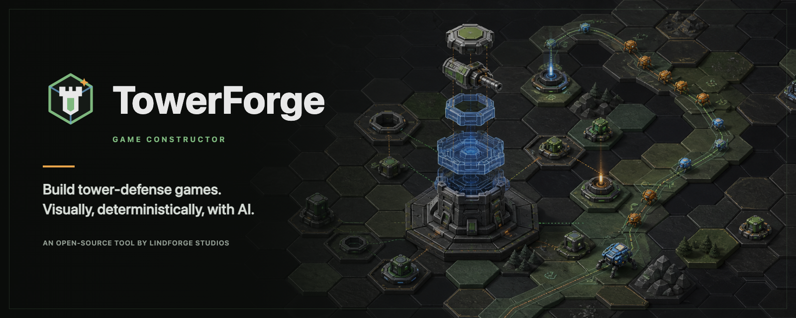

<p align="center">
  
</p>

<p align="center"><a href="README.md">Русский</a> · <strong>English</strong></p>

# TowerForge

**TowerForge by Lindforge Studios — build your own tower defense game.**

[](LICENSE)
[](package.json)
[](packages/desktop)
[](ARCHITECTURE.md)

TowerForge is an open-source, content-agnostic constructor for 2D hex tower-defense games. It provides a deterministic TypeScript simulation engine, a local browser editor for `.tdproj` projects, safe project-authored TowerScripts, a CLI for validation, headless simulation, and balance analysis, and a static web build target that produces a playable browser bundle (canvas or Phaser).

## Downloads

Desktop builds are published on [GitHub Releases](https://github.com/Lindforge-Studios/TowerForge/releases). Current alpha builds are explicitly marked **Unsigned build**. Verify the downloaded installer against the attached `SHA256SUMS` file before opening it. macOS installation notes and the unsigned-distribution policy live in [docs/releasing.md](docs/releasing.md).

## Product surface

| Product | What it is | Where |
| --- | --- | --- |
| **TowerForge Editor** | Map, content & balance editor (the Studio) | `packages/studio` |
| **TowerForge Desktop** | Installable Studio shell for Windows, macOS, and Linux | `packages/desktop` |
| **TowerForge AI** | AI assistant / MCP agent — drives the author → simulate → balance → patch loop | `packages/mcp` |
| **TowerForge Runtime** | Deterministic engine + renderers that run the built game | `packages/engine`, `packages/renderer` |
| **TowerForge Market** | Templates, assets, maps (planned — see `docs/ROADMAP.md`) | — |
| **TowerForge Academy** | Learning to build games (planned) | — |

## Quick Start

```bash
npm install
npm run studio
```

Studio opens at `http://localhost:5174` and edits `examples/starter.tdproj` by default. Russian is the default interface language; choose English in **Settings → Appearance → Language**.

## Common Commands

| Task | Command |
| --- | --- |
| Install | `npm install` |
| Create a project | `npx towerforge create my-game --template classic` (also `maze`, `idle`, or `roguelike`) |
| Run Studio | `npm run studio` |
| Run MCP server | `npm run mcp -- --project examples/starter.tdproj` |
| Connect an AI client (Claude Code / Codex / Claude Desktop / Cursor / VS Code) | `npx towerforge mcp:connect <project> [--client <id> --write]` — or the client picker in Studio → Settings → AI Agent Integration |
| Validate project | `npm run validate` |
| Validate as JSON | `npm run validate -- --json` |
| Simulate starter mission | `npm run sim tutorial_01 60` |
| Simulate as JSON | `npm run sim tutorial_01 60 -- --json` |
| Run balance sweep | `npm run balance -- --project examples/starter.tdproj` |
| Compile map sources | `npm run maps:compile -- --project examples/starter.tdproj` |
| Write schema migrations | `npm run migrate -- --project examples/starter.tdproj --write` |
| Typecheck engine | `npm run typecheck` |
| Compile engine runtime | `npm run build:engine` |
| Build playable web bundle | `npm run build` |
| Build with double-clickable single HTML | `npm run build -- --single-file` |
| Package portable web ZIP + loopback launcher | `npm run package:web -- --project examples/starter.tdproj` |
| Export verified project handoff | `npm run project:export -- --project examples/starter.tdproj --out game.tdpack` |
| Import verified project handoff | `npm run project:import -- game.tdpack --dir ./projects` |
| List bundled visual themes | `npm run themes:list` |
| Preview/apply a visual theme | `npm run themes:apply -- verdant-frontier --project examples/starter.tdproj --dry-run` |
| Package mobile scaffold | `node packages/cli/package.mjs --project examples/starter.tdproj --kind mobile` |
| Package desktop scaffold | `node packages/cli/package.mjs --project examples/starter.tdproj --kind desktop` |
| Run desktop Studio shell | `npm run desktop:dev` |
| Build desktop Studio installers | `npm run desktop:build` |
| Build platform-specific Studio installers | `npm run desktop:build:mac`, `npm run desktop:build:win`, or `npm run desktop:build:linux` |
| Unit and integration tests | `npm run test` |
| Browser smoke test | `npm run test:e2e` |

The build command writes `examples/starter.tdproj/dist` for the starter project. Studio can open the built game in its confined preview. From a terminal, preview it with a loopback static server:

```bash
python3 -m http.server 5175 --bind 127.0.0.1 --directory examples/starter.tdproj/dist
```

Then open `http://127.0.0.1:5175`.

## Project Format

A `.tdproj` directory is the source of a game:

- `project.json` stores project metadata.
- `content/balance.json` stores constants, difficulties, meta progression/rewards, abilities, enemies, towers, waves, and missions.
- `content/world-map.json` stores regions and mission nodes.
- `content/visuals.json` stores the local visual catalog, asset bindings, atlas refs, and sprite refs.
- `content/story-comics.json` stores mission-linked narrative panels.
- `content/battle-backgrounds.json` stores mission colors and optional sprite backdrops.
- `maps/src/*.tmj` stores editable hex map sources.
- `maps/compiled/maps.json` stores runtime map definitions generated from source maps.
- `scripts/**/*.tower.json` stores deterministic custom gameplay bound to global, mission, map, wave, tower, enemy, or ability scopes.
- `build-targets.json` stores output targets.
- `.towerforge/` stores local editor state and backups and MUST NOT be committed.

## Architecture

Canonical module boundaries and invariants live in [ARCHITECTURE.md](ARCHITECTURE.md). Product architecture and roadmap details live in [docs/td-constructor-architecture.md](docs/td-constructor-architecture.md).

Brand assets, palette, naming, and export instructions live in [docs/brand.md](docs/brand.md). The checked-in [English social preview](assets/brand/towerforge-social-preview-en.png) is ready for GitHub repository settings; a [Russian version](assets/brand/towerforge-social-preview.png) is included alongside it.

## Simulation And Balance Reports

`npm run sim ... -- --json` and the MCP `simulate_mission` tool return an agent-readable smoke report: outcome, aggregate event counts, event timeline, resource timeline, milestone snapshots, the deterministic strategy used, and next valid actions. `npm run balance` and MCP `balance_report` run a deterministic multi-strategy sweep with per-mission win rate, surviving core HP, tower usage, strategy metadata, and advisor flags.

## Agent Harness

Agent policy lives in [AGENTS.md](AGENTS.md). Operations are in [docs/runbook.md](docs/runbook.md), release policy is in [docs/releasing.md](docs/releasing.md), architecture decisions are in [docs/adr/](docs/adr/), and reference examples are in [docs/examples/](docs/examples/).

Studio **AI Chat** and external MCP clients share the same tool registry and authoring policy. Domain-scoped schema discovery teaches agents when to use universal effects, TowerScript, difficulty/meta progression, or themes. Tools advertise risk metadata and prefer previewed, revision-guarded writes such as `apply_progression_patch`, `upsert_tower_script`, `apply_theme_pack`, granular entity/map/asset/narrative operations, validation, and rollback over broad replacement. Compact reads expose project concepts without raw filesystem access. Settings offers ChatGPT OAuth through Codex App Server, Claude account auth through the bundled Claude Agent SDK/runtime, and direct Anthropic, OpenAI, or OpenRouter keys. The right-side chat supports Ask/Plan/Act permissions, model catalogs, reasoning effort, images, and locally sampled video frames; official runtimes retain ownership of OAuth credentials.

## License

MIT. See [LICENSE](LICENSE).
