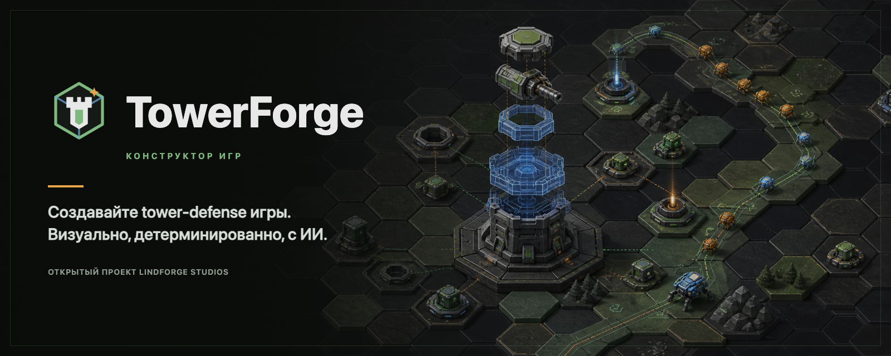

<p align="center">
  
</p>

<p align="center"><strong>Русский</strong> · <a href="README.en.md">English</a></p>

# TowerForge

**TowerForge от Lindforge Studios — создавайте собственные tower-defense игры.**

[](LICENSE)
[](package.json)
[](packages/desktop)
[](ARCHITECTURE.md)

TowerForge — открытый и независимый от конкретного контента конструктор 2D tower-defense игр с гексагональными и квадратными картами. В него входят детерминированный движок симуляции на TypeScript, локальный браузерный редактор проектов `.tdproj`, Wang/autotile pipeline, безопасные пользовательские TowerScript-сценарии, CLI для проверки, headless-симуляции и анализа баланса, а также статическая веб-сборка с Canvas- или Phaser-рендерером.

## Загрузки

Desktop-сборки публикуются в [GitHub Releases](https://github.com/Lindforge-Studios/TowerForge/releases). Текущие alpha-версии явно помечаются как **Unsigned build**. Перед запуском сверяйте установщик с приложенным файлом `SHA256SUMS`. Инструкции по установке на macOS и политика распространения неподписанных сборок находятся в [docs/releasing.md](docs/releasing.md).

## Состав продукта

| Компонент | Назначение | Расположение |
| --- | --- | --- |
| **TowerForge Editor** | Редактор карт, контента и баланса | `packages/studio` |
| **TowerForge Desktop** | Устанавливаемая оболочка Studio для Windows, macOS и Linux | `packages/desktop` |
| **TowerForge AI** | ИИ-помощник и MCP-агент для цикла создание → симуляция → баланс → изменение | `packages/mcp` |
| **TowerForge Runtime** | Детерминированный движок и рендереры собранной игры | `packages/engine`, `packages/renderer` |
| **TowerForge Market** | Шаблоны, ресурсы и карты, запланировано в [ROADMAP](docs/ROADMAP.md) | — |
| **TowerForge Academy** | Обучение созданию игр, запланировано | — |

## Быстрый старт

```bash
npm install
npm run studio
```

Studio откроется по адресу `http://localhost:5174` и по умолчанию загрузит `examples/starter.tdproj`. Основной язык интерфейса — русский; английский можно выбрать в **Настройки → Внешний вид → Язык**.

## Основные команды

| Задача | Команда |
| --- | --- |
| Установить зависимости | `npm install` |
| Создать проект | `npx towerforge create my-game --template classic --grid square`, сетки `hex`/`square`, шаблоны `classic`, `maze`, `idle`, `roguelike` |
| Запустить Studio | `npm run studio` |
| Запустить MCP-сервер | `npm run mcp -- --project examples/starter.tdproj` |
| Собрать Codex plugin | `npm run plugin:build` |
| Проверить Codex plugin | `npm run plugin:validate && npm run plugin:smoke` |
| Подключить ИИ-клиент | `npx towerforge mcp:connect <project> [--client <id> --write]` или выбор клиента в **Настройки → Интеграция ИИ-агентов** |
| Проверить проект | `npm run validate` |
| Получить результат проверки в JSON | `npm run validate -- --json` |
| Симулировать стартовую миссию | `npm run sim tutorial_01 60` |
| Получить симуляцию в JSON | `npm run sim tutorial_01 60 -- --json` |
| Запустить анализ баланса | `npm run balance -- --project examples/starter.tdproj` |
| Скомпилировать исходные карты | `npm run maps:compile -- --project examples/starter.tdproj` |
| Записать миграции схемы | `npm run migrate -- --project examples/starter.tdproj --write` |
| Проверить типы движка | `npm run typecheck` |
| Собрать runtime движка | `npm run build:engine` |
| Собрать веб-игру | `npm run build` |
| Собрать единый HTML-файл | `npm run build -- --single-file` |
| Упаковать переносимый веб-ZIP | `npm run package:web -- --project examples/starter.tdproj` |
| Экспортировать проверенный проект | `npm run project:export -- --project examples/starter.tdproj --out game.tdpack` |
| Импортировать проект | `npm run project:import -- game.tdpack --dir ./projects` |
| Показать встроенные темы | `npm run themes:list` |
| Просмотреть или применить тему | `npm run themes:apply -- verdant-frontier --project examples/starter.tdproj --dry-run` |
| Создать mobile-scaffold | `node packages/cli/package.mjs --project examples/starter.tdproj --kind mobile` |
| Создать desktop-scaffold игры | `node packages/cli/package.mjs --project examples/starter.tdproj --kind desktop` |
| Запустить desktop Studio | `npm run desktop:dev` |
| Собрать установщики Studio | `npm run desktop:build` |
| Собрать установщики для текущей ОС | `npm run desktop:build:mac`, `npm run desktop:build:win` или `npm run desktop:build:linux` |
| Пересобрать бренд-баннеры | `npm run brand:build` |
| Пересобрать нативные иконки | `npm run brand:icons` |
| Пересобрать встроенные tile sheets | `npm run tiles:build-presets` |
| Запустить unit- и integration-тесты | `npm run test` |
| Запустить браузерные E2E-тесты | `npm run test:e2e` |

Команда сборки записывает результат стартового проекта в `examples/starter.tdproj/dist`. Studio умеет открывать собранную игру в изолированном предпросмотре. Для ручного просмотра через loopback-сервер:

```bash
python3 -m http.server 5175 --bind 127.0.0.1 --directory examples/starter.tdproj/dist
```

Затем откройте `http://127.0.0.1:5175`.

## Формат проекта

Каталог `.tdproj` является исходным кодом игры:

- `project.json` — метаданные проекта.
- `content/balance.json` — константы, типизированный terrain registry, сложности, метапрогрессия, награды, способности, враги, башни, волны и миссии.
- `content/world-map.json` — регионы и узлы миссий.
- `content/visuals.json` — визуальный каталог v2: атласы, спрайты, tilesets, Wang/signature rules, веса, transforms и map/grid bindings.
- `content/story-comics.json` — сюжетные панели, связанные с миссиями.
- `content/battle-backgrounds.json` — цвета миссий и необязательные фоновые спрайты.
- `maps/src/*.tmj` — редактируемые исходные карты.
- `maps/compiled/maps.json` — runtime-описания карт, созданные компилятором.
- `scripts/**/*.tower.json` — детерминированная пользовательская логика, включая terrain scope, tile events и контролируемые runtime terrain changes.
- `build-targets.json` — цели сборки.
- `.towerforge/` — локальное состояние редактора и резервные копии; каталог нельзя добавлять в git.

## Архитектура

Канонические границы модулей и инварианты описаны в [ARCHITECTURE.md](ARCHITECTURE.md). Продуктовая архитектура и roadmap находятся в [docs/td-constructor-architecture.md](docs/td-constructor-architecture.md).

Бренд-ресурсы, палитра, правила нейминга и экспорта описаны в [docs/brand.md](docs/brand.md). Русский [social preview](assets/brand/towerforge-social-preview.png) подготовлен для настроек GitHub; рядом находится [английская версия](assets/brand/towerforge-social-preview-en.png).

## Отчёты симуляции и баланса

`npm run sim ... -- --json` и MCP-инструмент `simulate_mission` возвращают отчёт для агента: исход, агрегированные события, временную шкалу событий и ресурсов, снимки ключевых моментов, детерминированную стратегию и следующие допустимые действия. `npm run balance` и MCP-инструмент `balance_report` запускают несколько детерминированных стратегий и показывают процент побед, оставшееся здоровье ядра, использование башен, параметры стратегий и предупреждения советника.

## Agent Harness

Правила агентов находятся в [AGENTS.md](AGENTS.md), операционные инструкции — в [docs/runbook.md](docs/runbook.md), политика релизов — в [docs/releasing.md](docs/releasing.md), архитектурные решения — в [docs/adr/](docs/adr/), примеры — в [docs/examples/](docs/examples/).

Встроенный **Чат с ИИ** и внешние MCP-клиенты используют общий реестр инструментов и единую политику авторинга. Доменное описание схем объясняет агентам, когда применять универсальные эффекты, TowerScript, сложность и метапрогрессию или визуальные темы. Инструменты публикуют метаданные риска и предпочитают preview, revision guard, узкие изменения, проверку и rollback. В настройках доступны ChatGPT OAuth через Codex App Server, аккаунт Claude через Claude Agent SDK/runtime и прямые ключи Anthropic, OpenAI и OpenRouter. Правая панель чата поддерживает режимы вопроса, плана и действия, выбор модели и уровня рассуждений, изображения и локально извлечённые кадры видео.

Для Codex доступен отдельный public marketplace [`towerforge-codex-plugin`](https://github.com/Lindforge-Studios/towerforge-codex-plugin). Его release bundle детерминированно собирается из [`plugins/towerforge`](plugins/towerforge) в этом репозитории. Плагин добавляет skill и локальный MCP runtime без API-ключа и TowerForge cloud account. Сервер ищет `.tdproj` только в файловых roots текущей Codex workspace, не принимает абсолютный `projectDir` от модели и удаляет локальные пути из ответов. Полная установка и модель безопасности описаны в [runbook](docs/runbook.md#codex-marketplace-plugin).

## Лицензия

MIT. См. [LICENSE](LICENSE).
